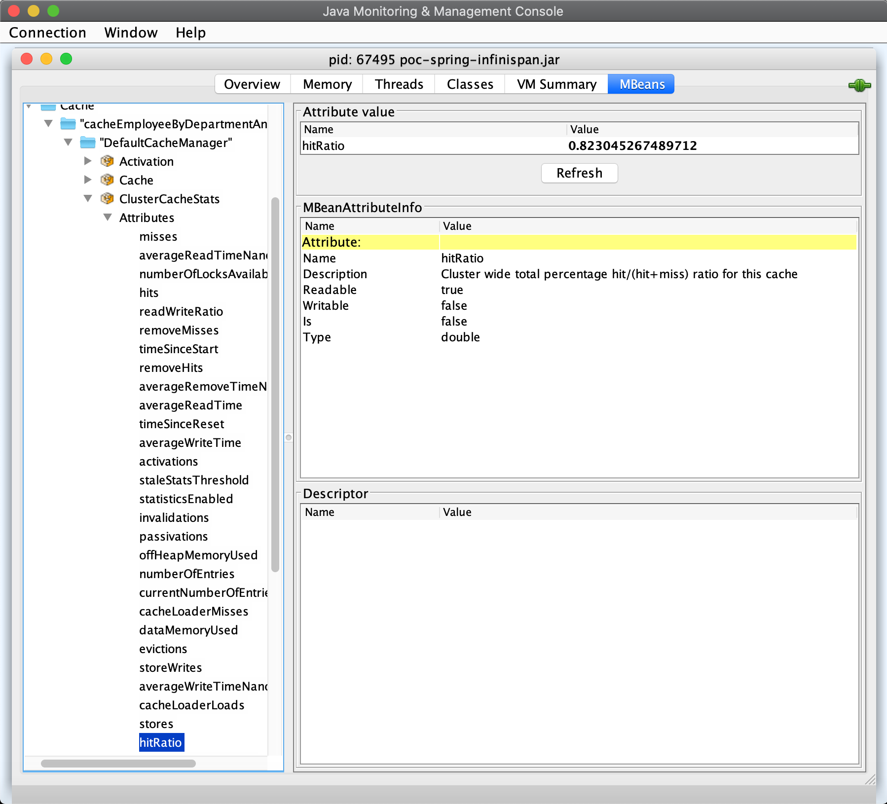

## Spring Boot + Embedded Infinispan Cluster

### Build and Run

To build the node perform the following command
```
mvn clean install
```

#### Start node #1

Once the build process is accomplished, start the very first node - single node cluster
```
java -Djava.net.preferIPv4Stack=true -jar ./target/poc-spring-infinispan.jar
```

After the start of the node you should be able to see within the logs:
```
2020-09-19 14:45:19.058  INFO 67467 --- [           main] o.i.r.t.jgroups.JGroupsTransport         : ISPN000079: Channel employeeCluster local address is Maksyms-MakBook-26688, physical addresses are [192.168.88.228:51047]
2020-09-19 14:45:19.660  INFO 67467 --- [           main] o.s.s.concurrent.ThreadPoolTaskExecutor  : Initializing ExecutorService 'applicationTaskExecutor'
2020-09-19 14:45:19.844  INFO 67467 --- [           main] o.s.b.w.embedded.tomcat.TomcatWebServer  : Tomcat started on port(s): 8080 (http) with context path ''
2020-09-19 14:45:19.848  INFO 67467 --- [           main] com.poc.spring.infinispan.Application    : Started Application in 8.566 seconds (JVM running for 8.944)
```
that means our single node cluster has started.

Wait a little bit and you will see the work of our cluster, e.g. the cache hits and misses (see the time taken to perform the employee lookup task):
```
2020-09-19 14:45:24.856  INFO 67467 --- [pool-2-thread-1] c.p.s.i.config.SchedulerConfiguration    : Adding key SimpleKey [DPT_ID,Jane] to cache
2020-09-19 14:45:24.860  INFO 67467 --- [pool-2-thread-1] c.p.spring.infinispan.TimeBasedConsumer  : Looked up the Employee Jane in 5033 ms
2020-09-19 14:45:26.863  INFO 67467 --- [pool-2-thread-1] c.p.s.i.config.SchedulerConfiguration    : Key SimpleKey [DPT_ID,Jane] was visited
2020-09-19 14:45:26.864  INFO 67467 --- [pool-2-thread-1] c.p.spring.infinispan.TimeBasedConsumer  : Looked up the Employee Jane in 4 ms
2020-09-19 14:45:28.869  INFO 67467 --- [pool-2-thread-1] c.p.s.i.config.SchedulerConfiguration    : Key SimpleKey [DPT_ID,Jane] was visited
2020-09-19 14:45:28.869  INFO 67467 --- [pool-2-thread-1] c.p.spring.infinispan.TimeBasedConsumer  : Looked up the Employee Jane in 0 ms
2020-09-19 14:45:30.870  INFO 67467 --- [pool-2-thread-1] c.p.s.i.config.SchedulerConfiguration    : Key SimpleKey [DPT_ID,Jane] was visited
2020-09-19 14:45:30.870  INFO 67467 --- [pool-2-thread-1] c.p.spring.infinispan.TimeBasedConsumer  : Looked up the Employee Jane in 0 ms
2020-09-19 14:45:37.875  INFO 67467 --- [pool-2-thread-1] c.p.s.i.config.SchedulerConfiguration    : Adding key SimpleKey [DPT_ID,David] to cache
2020-09-19 14:45:37.876  INFO 67467 --- [pool-2-thread-1] c.p.spring.infinispan.TimeBasedConsumer  : Looked up the Employee David in 5004 ms
``` 

#### Start node #2

Now we are ready to start the node #2
```
java -Dserver.port=8081 -Djava.net.preferIPv4Stack=true -jar ./target/poc-spring-infinispan.jar
```

Once started inspect the logs of node #1
```
2020-09-19 14:48:27.204  INFO 67467 --- [s-MakBook-26688] org.infinispan.CLUSTER                   : ISPN100000: Node Maksyms-MakBook-23354 joined the cluster
2020-09-19 14:48:27.231 DEBUG 67467 --- [s-MakBook-26688] org.jgroups.protocols.pbcast.STABLE      : resuming message garbage collection
2020-09-19 14:48:27.547  INFO 67467 --- [e-thread--p2-t1] org.infinispan.CLUSTER                   : [Context=org.infinispan.CONFIG] ISPN100002: Starting rebalance with members [Maksyms-MakBook-26688, Maksyms-MakBook-23354], phase READ_OLD_WRITE_ALL, topology id 2
2020-09-19 14:48:27.596  INFO 67467 --- [e-thread--p2-t1] org.infinispan.CLUSTER                   : [Context=org.infinispan.CONFIG] ISPN100009: Advancing to rebalance phase READ_ALL_WRITE_ALL, topology id 3
2020-09-19 14:48:27.611  INFO 67467 --- [e-thread--p2-t1] org.infinispan.CLUSTER                   : [Context=org.infinispan.CONFIG] ISPN100009: Advancing to rebalance phase READ_NEW_WRITE_ALL, topology id 4
2020-09-19 14:48:27.614  INFO 67467 --- [e-thread--p2-t1] org.infinispan.CLUSTER                   : [Context=org.infinispan.CONFIG] ISPN100010: Finished rebalance with members [Maksyms-MakBook-26688, Maksyms-MakBook-23354], topology id 5
```

they tell us that node #2 has successfully joined the cluster

### Monitoring

Now as we have our cache cluster running, we are ready to inspect the performance of our cache.

As our cache level configuration allows the statistics to be collected, we can use `jconsole` to inspect the `hitRatio`, which we are interested the most.



As seen on a screenshot above we have quite high `hitRatio`, which means that the data is quite often pulled from the cache, which is basically the purpose of using it.


